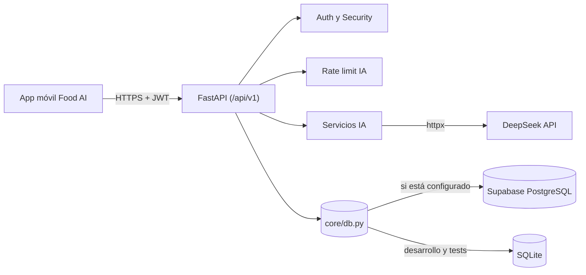

<div align="center">

# Food AI — Backend API

**API REST para gestionar la despensa, escanear alimentos y generar recetas con IA.**


</div>

---

## Tabla de contenido

- [Acerca del proyecto](#acerca-del-proyecto)
- [Características principales](#características-principales)
- [Stack tecnológico](#stack-tecnológico)
- [Arquitectura y cómo funciona](#arquitectura-y-cómo-funciona)
- [Relación con la app móvil](#relación-con-la-app-móvil)
- [Instalación y ejecución](#instalación-y-ejecución)
- [Pruebas](#pruebas)
- [Estructura de carpetas](#estructura-de-carpetas)
- [Cómo contribuir](#cómo-contribuir)
- [Licencia](#licencia)

## Acerca del proyecto

**Food AI Backend** es el servicio que da soporte a la aplicación móvil **Food AI**. Resuelve un problema cotidiano: saber qué hay en la despensa, cuándo vence y qué se puede cocinar con ello.

Está pensado para usuarios finales de la app móvil (a través de ella) y para desarrolladores que mantengan o extiendan el ecosistema. Expone una API REST que:

- Autentica usuarios y aísla los datos de cada uno.
- Analiza fotografías de alimentos con un modelo de visión (DeepSeek) y devuelve ingredientes estructurados.
- Genera recetas y pasos de preparación a partir de los ingredientes disponibles.
- Persiste inventario, lista de compras y recetas guardadas.

## Características principales

- **Autenticación** con registro, inicio de sesión y `/auth/me`; contraseñas con PBKDF2-HMAC-SHA256 (600 000 iteraciones) y tokens JWT (HS256).
- **Escaneo de alimentos con IA**: acepta imagen en `base64` (JSON) o `multipart/form-data`, límite de 10 MB, y devuelve ingredientes con categoría, cantidad, unidad y confianza.
- **Generación de recetas con IA** con parámetros de dificultad, enfoque, tiempo máximo, porciones, preferencia dietética e ingredientes a evitar, más caché de corta duración y validaciones de coherencia culinaria.
- **Inventario** (CRUD, borrado por lotes) con operaciones idempotentes para sincronización offline.
- **Lista de compras** (CRUD, alta por lotes, borrado de comprados).
- **Recetas guardadas** por usuario.
- **Límite de uso de IA** por usuario y global, en memoria.
- **Seguridad**: cabeceras HTTP de seguridad, CORS configurable, validación de configuración en producción y políticas RLS para Supabase (`migrations/01_enable_rls.sql`).
- **Persistencia dual**: Supabase cuando está configurado; SQLite local para desarrollo y pruebas.

## Stack tecnológico

| Componente | Tecnología | Versión |
|---|---|---|
| Lenguaje | Python | 3.12.8 (`runtime.txt`) |
| Framework web | FastAPI | ≥ 0.110.0 |
| Servidor ASGI | Uvicorn (`standard`) / Gunicorn | ≥ 0.28.0 / ≥ 21.2.0 |
| Validación | Pydantic | ≥ 2.0.0 |
| Formularios multipart | python-multipart | ≥ 0.0.9 |
| Cliente HTTP | httpx | ≥ 0.27.0 |
| Base de datos (nube) | Supabase (PostgreSQL) — `supabase` | ≥ 2.0.0 |
| Base de datos (local) | SQLite (módulo estándar) | — |
| IA | API de DeepSeek (visión y chat) | — |
| Pruebas | pytest | ≥ 8.0.0 |
| Despliegue | Heroku (`Procfile`) | — |

## Arquitectura y cómo funciona



Capas principales:

| Capa | Carpeta | Responsabilidad |
|---|---|---|
| Rutas | `app/api/v1/` | Endpoints REST agrupados por dominio |
| Esquemas | `app/schemas/` | Modelos Pydantic de entrada/salida |
| Servicios | `app/services/` | Lógica de autenticación y generación de recetas con IA |
| Núcleo | `app/core/` | Configuración, acceso a datos, seguridad y límites de uso |

**Flujo de punta a punta: escanear la despensa**

1. La app envía `POST /api/v1/scan` con la foto en base64 y el token Bearer.
2. `get_current_user_id` valida el JWT; se aplica el límite de llamadas de IA por usuario y global.
3. Se valida el tamaño (≤ 10 MB) y el servicio consulta el modelo de visión de DeepSeek.
4. La respuesta se valida contra el esquema `ScanResponse` (`is_food`, `ingredients`, `warnings`); si es inválida, se responde `502`.
5. La app muestra los ingredientes detectados; al confirmarlos, los guarda con `POST /api/v1/inventory`, que persiste en Supabase (o SQLite en local) asociados al usuario.

> Si la clave de IA no está configurada, los endpoints de escaneo y generación responden `503`. Si Supabase está configurado pero no disponible, la API responde `503` en lugar de degradar silenciosamente a SQLite.

## Relación con la app móvil

Este repositorio es el backend de **[App-mobile-front](https://github.com/StehvenObandoUcc/App-mobile-front)** (app móvil Expo / React Native).

- **Protocolo:** REST sobre HTTP(S), prefijo `/api/v1`.
- **Formato:** JSON (el escaneo admite además `multipart/form-data`).
- **Autenticación:** cabecera `Authorization: Bearer <token>` obtenida en `/auth/login` o `/auth/register`.
- **Consumo:** la app centraliza las llamadas en `src/services/api-client.ts` y reintenta mutaciones offline mediante una cola (outbox).

### Endpoints principales

| Método | Ruta | Descripción | Auth |
|---|---|---|---|
| GET | `/api/v1/health` | Estado del servicio | No |
| POST | `/api/v1/auth/register` | Registro de usuario | No |
| POST | `/api/v1/auth/login` | Inicio de sesión | No |
| GET | `/api/v1/auth/me` | Usuario actual | Sí |
| POST | `/api/v1/scan` | Analiza una imagen de alimentos | Sí |
| GET | `/api/v1/inventory` | Lista el inventario | Sí |
| POST | `/api/v1/inventory` | Crea un ingrediente | Sí |
| PUT | `/api/v1/inventory/{id}` | Actualiza un ingrediente | Sí |
| DELETE | `/api/v1/inventory/{id}` | Elimina un ingrediente | Sí |
| POST | `/api/v1/inventory/batch-delete` | Elimina varios ingredientes | Sí |
| GET | `/api/v1/shopping` | Lista de compras | Sí |
| POST | `/api/v1/shopping` · `/batch` | Crea uno o varios ítems | Sí |
| PUT | `/api/v1/shopping/{id}` | Actualiza un ítem | Sí |
| DELETE | `/api/v1/shopping/{id}` · `/bought` | Elimina un ítem o los comprados | Sí |
| GET | `/api/v1/recipes` | Sugerencias base o recetas guardadas | Opcional |
| POST | `/api/v1/recipes` · `/recipes/generate` | Genera recetas con IA | Sí |
| POST | `/api/v1/recipes/steps` | Genera los pasos de una receta | Por confirmar |
| GET | `/api/v1/recipes/saved` | Recetas guardadas | Sí |
| POST | `/api/v1/recipes/save` | Guarda una receta | Por confirmar |
| DELETE | `/api/v1/recipes/saved/{id}` | Elimina una receta guardada | Por confirmar |
| POST | `/api/v1/recipes/saved/batch-delete` | Elimina varias recetas guardadas | Por confirmar |

La documentación interactiva queda disponible en `/docs` (Swagger UI) y `/redoc` al ejecutar el servidor.

## Instalación y ejecución

### Requisitos

- Python 3.12 (el repo fija `python-3.12.8` en `runtime.txt`; la versión mínima soportada es **Por confirmar**).
- Un archivo de entorno propio (`.env` en la carpeta del backend) con la configuración necesaria. No se documentan aquí sus variables ni se incluye ninguno en el repositorio.

### Pasos (Windows PowerShell)

```powershell
# 1. Clonar y entrar al backend
git clone https://github.com/StehvenObandoUcc/backend-mobile.git
cd backend-mobile

# 2. Crear y activar el entorno virtual
py -3.12 -m venv .venv
.\.venv\Scripts\Activate.ps1

# 3. Instalar dependencias
pip install -r requirements.txt

# 4. Crear tu archivo de entorno propio (.env) con tu configuración

# 5. Iniciar el servidor
uvicorn app.main:app --reload --host 0.0.0.0 --port 8000
```

En Linux/macOS, activa el entorno con `source .venv/bin/activate`.

> `--host 0.0.0.0` permite que un teléfono físico o emulador acceda a la API desde la IP local del equipo.

Verifica el servicio en `http://localhost:8000/api/v1/health` y explora la API en `http://localhost:8000/docs`.

### Despliegue

El `Procfile` define el proceso web para Heroku: `uvicorn app.main:app --host 0.0.0.0 --port $PORT`. En producción, la aplicación se niega a arrancar si el secreto JWT es inseguro.

## Pruebas

Con el entorno virtual activado:

```powershell
pytest
```

La suite cubre autenticación, rutas, inventario y persistencia, validación, recetas y coherencia culinaria, idempotencia, endurecimiento de seguridad y políticas RLS de Supabase.

## Estructura de carpetas

```
.
├── app/
│   ├── main.py              # Aplicación FastAPI, CORS, cabeceras de seguridad y ciclo de vida
│   ├── api/v1/              # Endpoints: auth, health, inventory, recipes, scan, shopping
│   ├── core/                # config, db (Supabase/SQLite), security (hash + JWT), rate_limit
│   ├── schemas/             # Modelos Pydantic: auth, ingredient, recipe, scan, shopping
│   └── services/            # auth_service, ai_recipe_service
├── migrations/
│   └── 01_enable_rls.sql    # Políticas Row Level Security para Supabase
├── tests/                   # Suite pytest
├── Procfile                 # Proceso web para Heroku
├── requirements.txt         # Dependencias de Python
└── runtime.txt              # Versión de Python para despliegue
```

## Cómo contribuir

1. Haz un fork del repositorio y crea una rama descriptiva: `git checkout -b feat/mi-cambio`.
2. Realiza tus cambios con pruebas que los respalden y ejecuta `pytest` antes de enviar.
3. Usa mensajes de commit claros (por ejemplo, [Conventional Commits](https://www.conventionalcommits.org/es/)).
4. Abre un Pull Request describiendo qué cambia y por qué.
5. Nunca incluyas claves, tokens ni archivos `.env` en tus commits.

## Licencia

Por confirmar. El repositorio no incluye un archivo de licencia.
